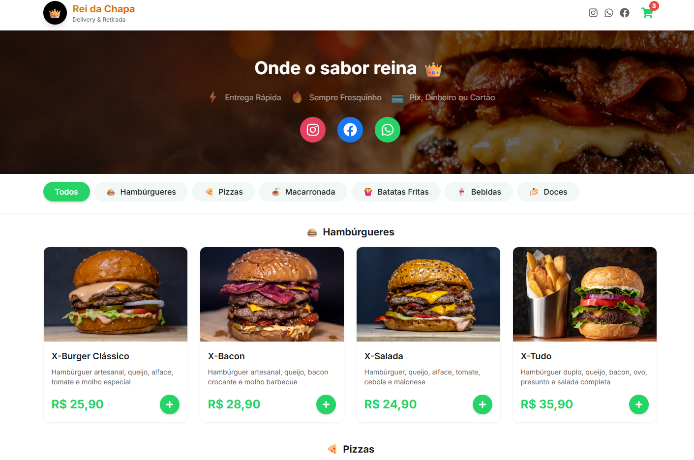
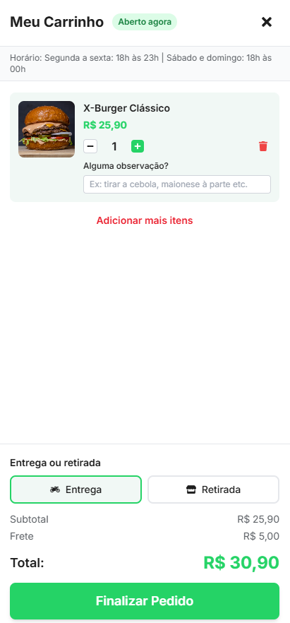
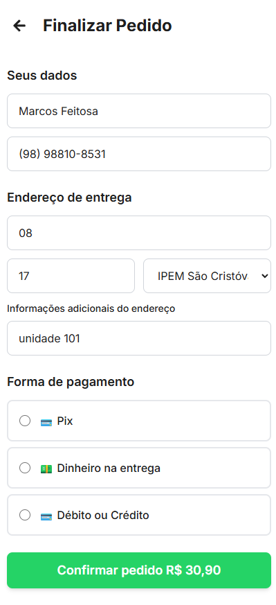
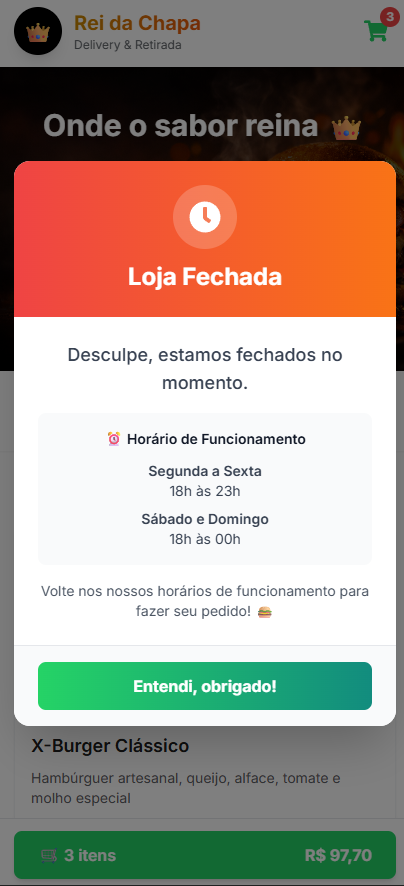

# 🍔 AutomaLanches - Sistema de Pedidos Online

<div align="center">


Sistema web profissional de pedidos online para lanchonetes, desenvolvido com foco **mobile-first**, integração automática com **Telegram Bot** para recebimento e gestão de pedidos, **controle inteligente de horário de funcionamento** e fluxo de pagamento **Pix** com confirmação via **WhatsApp**.

[Demonstração](#-demonstração) • [Funcionalidades](#-funcionalidades) • [Tecnologias](#-tecnologias) • [Instalação](#️-instalação) • [Deploy](#-deploy)

</div>

---

---

## 📸 Demonstração

### Página Inicial
Interface moderna e responsiva com cardápio completo organizado por categorias.



### Carrinho de Compras
Sistema inteligente de gerenciamento de pedidos com **status em tempo real** de abertura/fechamento da loja, atualização automática a cada 60 segundos e indicador visual de horário de funcionamento.



### Finalização de Pedido
Formulário completo e intuitivo com validação em tempo real, coleta de dados pessoais, seleção de endereço (para delivery) e múltiplas formas de pagamento (Pix, Dinheiro, Cartão).



### Notificação de Loja Fechada
Sistema elegante e profissional de avisos quando o estabelecimento está fora do horário de funcionamento, exibindo informações claras sobre os horários e prevenindo frustração do cliente.



### Pedido no Telegram
Integração completa com bot do Telegram para gerenciamento de pedidos em tempo real, com botões interativos para atualização de status, formatação profissional e timestamps precisos.


---


## 🎯 Funcionalidades

### 🛒 Sistema de Pedidos
- ✅ **Design Mobile-First** - Interface otimizada para dispositivos móveis
- ✅ **Cardápio por Categorias** - Hambúrgueres, Bebidas, Doces e Outros
- ✅ **Carrinho Inteligente** - Gerenciamento completo de itens com observações personalizadas
- ✅ **Entrega ou Retirada** - Cliente escolhe como receber o pedido
- ✅ **Pedido Mínimo** - Sistema de validação de valor mínimo (R$ 20,00)
- ✅ **Persistência de Dados** - Informações do cliente salvas localmente

### 💳 Pagamento
- ✅ **Múltiplas Formas** - Pix, Dinheiro ou Cartão (Visa, Mastercard, Elo)
- ✅ **Sistema Pix Realista** - Geração de QR Code e código copia e cola
- ✅ **Comprovante via WhatsApp** - Envio direto do comprovante
- ✅ **Gestão de Troco** - Cálculo automático quando pagamento em dinheiro

### ⏰ Controle de Horário
- ✅ **Horário Automático** - Sistema verifica se loja está aberta/fechada
  - Segunda a Sexta: 18h às 23h
  - Sábado e Domingo: 18h às 00h
- ✅ **Tag de Status em Tempo Real** - Indicador visual no carrinho (atualiza a cada 60s)
- ✅ **Bloqueio Inteligente** - Impede pedidos fora do horário
- ✅ **Notificação Elegante** - Aviso profissional quando estabelecimento está fechado
- ✅ **Timezone Correto** - Timestamps precisos baseados em America/Fortaleza
- ✅ **Override Manual** - Controle via variáveis de ambiente:
  - `FORCE_OPEN=true` → Força abertura (promoções, eventos)
  - `FORCE_CLOSED=true` → Força fechamento (feriados, manutenção)

### 🤖 Integração Telegram Bot
- ✅ **Pedidos Automáticos** - Envio instantâneo ao Telegram
- ✅ **Formatação Profissional** - Mensagens organizadas e legíveis
- ✅ **Data e Hora Precisas** - Timestamps com timezone configurável
- ✅ **Botões Interativos** - Atualização de status com um clique
  - 🍳 Pedido em preparo
  - 🚚 Saiu para entrega (delivery)
  - 🏪 Pronto para retirada (pickup)
  - 📲 Falar com cliente (abre WhatsApp)
- ✅ **Mensagens Personalizadas** - Notificações automáticas ao cliente
- ✅ **Link de Repetir Pedido** - Cliente pode refazer pedido anterior com 1 clique

### 🎨 Interface & UX
- ✅ **Animações Suaves** - Transições e feedbacks visuais
- ✅ **Lazy Loading** - Componentes carregados sob demanda
- ✅ **Code Splitting** - Otimização automática de bundle
- ✅ **Compressão Gzip** - Respostas comprimidas no backend
- ✅ **Cache Inteligente** - Headers de cache configurados
- ✅ **Validação de Formulários** - Feedback em tempo real
- ✅ **Máscaras de Input** - Formatação automática (WhatsApp, dinheiro)

### 🔒 Segurança & Performance
- ✅ **Variáveis de Ambiente** - Dados sensíveis protegidos
- ✅ **CORS Configurado** - Segurança de requisições
- ✅ **Limitação de Payload** - Proteção contra payloads grandes
- ✅ **Sanitização de Dados** - Limpeza de inputs do usuário
- ✅ **Healthcheck** - Endpoint para monitoramento
- ✅ **Restart Automático** - Recuperação em caso de erros

## 🚀 Tecnologias Utilizadas

### Frontend
- **React** - Biblioteca UI
- **Vite** - Build tool moderna e rápida
- **Tailwind CSS** - Estilização utility-first
- **Zustand** - Gerenciamento de estado
- **React Icons** - Ícones

### Backend
- **Node.js** - Runtime JavaScript
- **Express** - Framework web
- **node-telegram-bot-api** - Integração com Telegram
- **CORS** - Segurança de requisições
- **dotenv** - Variáveis de ambiente

## 📁 Estrutura do Projeto

```
automaLanches/
├── backend/
│   ├── server.js              # Servidor Express + Telegram Bot
│   ├── package.json
│   └── .env.example
├── src/
│   ├── components/
│   │   ├── Header.jsx         # Cabeçalho fixo
│   │   ├── Hero.jsx           # Banner principal
│   │   ├── CategoryFilter.jsx # Filtro de categorias
│   │   ├── ProductCard.jsx    # Card de produto
│   │   ├── ProductList.jsx    # Lista de produtos
│   │   ├── Cart.jsx           # Carrinho (drawer)
│   │   ├── CartButton.jsx     # Botão fixo do carrinho
│   │   ├── Checkout.jsx       # Formulário de checkout
│   │   ├── PixPayment.jsx     # Tela de pagamento Pix
│   │   └── OrderConfirmation.jsx # Confirmação do pedido
│   ├── data/
│   │   └── products.js        # Dados dos produtos
│   ├── services/
│   │   └── api.js             # Comunicação com backend
│   ├── store/
│   │   └── cartStore.js       # Zustand store
│   ├── App.jsx                # Componente principal
│   ├── main.jsx               # Entry point
│   └── index.css              # Estilos globais
├── index.html
├── package.json
├── vite.config.js
├── tailwind.config.js
└── .env.example
```

## ⚙️ Configuração e Instalação

### 1. Clone o repositório
```bash
git clone https://github.com/Ricardo-dev-00/AutomaLanches.git
cd automaLanches
```

### 2. Configurar Frontend

```bash
# Instalar dependências
npm install

# Criar arquivo .env
cp .env.example .env
```

Edite o arquivo `.env`:
```env
VITE_API_URL=http://localhost:3001
VITE_WHATSAPP_NUMBER=5511999999999
VITE_PIX_KEY=suachavepix@email.com
VITE_LANCHONETE_NAME=AutomaLanches
```

### 3. Configurar Backend

```bash
cd backend

# Instalar dependências
npm install

# Criar arquivo .env
cp .env.example .env
```

Edite o arquivo `backend/.env`:
```env
# Essencial
PORT=3001
NODE_ENV=development

# Telegram Bot
TELEGRAM_BOT_TOKEN=seu_token_do_bot_aqui
TELEGRAM_CHAT_ID=seu_chat_id_aqui

# PIX
PIX_KEY=sua_chave_pix@email.com
MERCHANT_NAME=AutomaLanches
MERCHANT_CITY=Sao Luis

# Frontend URL
FRONTEND_URL=http://localhost:5173

# Timezone (opcional)
BUSINESS_TIMEZONE=America/Fortaleza

# Controle Manual (opcional - remova ou deixe sem definir para modo automático)
# FORCE_OPEN=true    → Força loja ABERTA (ignora horário)
# FORCE_CLOSED=true  → Força loja FECHADA (ignora horário)
```
# Criar arquivo .env
cp .env.example .env
```

Edite o arquivo `backend/.env`:
```env
PORT=3001
TELEGRAM_BOT_TOKEN=seu_token_do_bot_aqui
TELEGRAM_CHAT_ID=seu_chat_id_aqui
```

### 4. Criar Bot do Telegram

1. Abra o Telegram e procure por **@BotFather**
2. Digite `/newbot` e siga as instruções
3. Copie o **token** fornecido
4. Para obter o **CHAT_ID**:
   - Inicie uma conversa com seu bot
   - Acesse: `https://api.telegram.org/bot<SEU_TOKEN>/getUpdates`
   - Procure pelo campo `"chat":{"id":`

### 5. Executar o Projeto

**Terminal 1 - Frontend:**
```bash
npm run dev
```
Acesse: http://localhost:5173

**Terminal 2 - Backend:**
```bash
cd backend
npm start
```
Rodando em: http://localhost:3001

## 🎨 Paleta de Cores

| Cor | Hex | Uso |
|-----|-----|-----|
| Primary | `#25D366` | Botões principais, destaques |
| Secondary | `#128C7E` | Hover states |
| Background | `#FFFFFF` | Fundo da página |
| Card | `#F1F8F5` | Fundo de cards |
| Text Primary | `#1E1E1E` | Texto principal |
| Text Secondary | `#5F6368` | Texto secundário |

## 📱 Fluxo do Cliente

1. **Navegação** - Cliente visualiza produtos por categoria
2. **Seleção** - Adiciona produtos ao carrinho
3. **Carrinho** - Revisa itens e quantidades
4. **Tipo de Entrega** - Escolhe entre Entrega ou Retirada
5. **Dados** - Preenche informações pessoais e endereço
6. **Pagamento** - Seleciona forma de pagamento
7. **Pix** (se escolhido):
   - Visualiza chave Pix
   - Copia a chave
   - Realiza pagamento no banco
   - Envia comprovante via WhatsApp
8. **Confirmação** - Pedido enviado automaticamente ao Telegram

## 🔐 Segurança

- ✅ Variáveis de ambiente para dados sensíveis
- ✅ Tokens nunca expostos no frontend
- ✅ CORS configurado no backend
- ✅ `.gitignore` protegendo arquivos sensíveis

## 📦 Scripts Disponíveis

### Frontend
```bash
npm run dev      # Desenvolvimento
npm run build    # Build de produção
npm run preview  # Preview da build
```

### Backend
```bash
npm start        # Produção
npm run dev      # Desenvolvimento com watch mode
```

## 🚀 Deploy

### Deploy no Railway (Recomendado)

O projeto está totalmente configurado para fazer deploy na **Railway** com frontend e backend integrados.

#### Variáveis de Ambiente Necessárias:

```env
# Essencial
NODE_ENV=production
PORT=3001

# Telegram (obrigatório)
TELEGRAM_BOT_TOKEN=seu_token_aqui
TELEGRAM_CHAT_ID=seu_chat_id_aqui

# PIX (obrigatório)
PIX_KEY=sua_chave_pix
MERCHANT_NAME=AutomaLanches
MERCHANT_CITY=Sao Luis

# Frontend (obrigatório)
FRONTEND_URL=https://seu-app.up.railway.app

# Timezone (opcional - padrão: America/Fortaleza)
BUSINESS_TIMEZONE=America/Fortaleza

# Controle Manual (opcional)
# FORCE_OPEN=true    # Força loja ABERTA (promoções, eventos especiais)
# FORCE_CLOSED=true  # Força loja FECHADA (feriados, manutenção)
# Deixe ambas sem definir para usar horário automático
```

#### Como fazer deploy:

1. **Conectar repositório**
   - Acesse [railway.app](https://railway.app/)
   - Clique em "New Project" → "Deploy from GitHub"
   - Selecione seu repositório

2. **Configurar variáveis**
   - No painel da Railway, vá em "Variables"
   - Adicione as variáveis acima
   - **Importante:** Não defina `FORCE_OPEN` e `FORCE_CLOSED` ao mesmo tempo

3. **Deploy automático**
   - Cada `git push` para `main` faz deploy automático
   - A URL será algo como: `https://seu-app.up.railway.app`

4. **Controle Manual de Horários** (após deploy)
   - Para forçar abertura: Adicione `FORCE_OPEN=true` nas variáveis
   - Para forçar fechamento: Adicione `FORCE_CLOSED=true` nas variáveis
   - Para voltar ao automático: Delete ambas as variáveis
   - Consulte [MANUAL_OVERRIDE.md](MANUAL_OVERRIDE.md) para detalhes

#### Características do Deploy:

- ✅ Build automático com Vite
- ✅ Frontend e backend na mesma aplicação
- ✅ Configuração de healthcheck automática
- ✅ Reinicialização automática em caso de erro
- ✅ URL relativa para API (funciona em qualquer domínio)
- ✅ CORS configurado automaticamente
- ✅ Cache headers otimizados

### Deploy no Vercel (Frontend) + Railway/Render (Backend)

Se preferir separado:

**Frontend (Vercel):**
```bash
npm run build
# Deploy da pasta dist/
```

**Backend (Railway/Render):**
- Deploy da pasta `backend/`
- Configure as mesmas variáveis de ambiente

---

## ⏰ Controle de Horário de Funcionamento

### Horário Automático (Padrão)

O sistema verifica automaticamente se a loja está aberta baseado no horário configurado:

```javascript
Segunda a Sexta: 18:00 - 23:00
Sábado e Domingo: 18:00 - 00:00
Timezone: America/Fortaleza
```

**Comportamento:**
- ✅ Clientes podem fazer pedidos apenas no horário
- ✅ Tag de status atualiza automaticamente no carrinho
- ✅ Notificação elegante quando tentar pedido fora do horário
- ✅ Timestamps dos pedidos sempre corretos

### Controle Manual (Override)

Para situações especiais, você pode **sobrescrever** o horário automático via variáveis de ambiente no Railway:

#### Forçar Abertura
Útil para: Promoções, eventos especiais, funcionamento em dias atípicos

```env
FORCE_OPEN=true
```
**Resultado:** Loja fica ABERTA 24h, independente do horário configurado

#### Forçar Fechamento
Útil para: Feriados, manutenção, emergências

```env
FORCE_CLOSED=true
```
**Resultado:** Loja fica FECHADA 24h, independente do horário configurado

#### Voltar ao Automático
**Delete** as variáveis `FORCE_OPEN` ou `FORCE_CLOSED` no Railway

**Resultado:** Sistema volta a usar o horário automático normal

### Como Usar no Railway

1. Acesse seu projeto no Railway
2. Vá em **Variables**
3. **Adicionar variável:**
   - Click em "+ New Variable"
   - Name: `FORCE_OPEN` ou `FORCE_CLOSED`
   - Value: `true`
   - Save
4. **Remover override:**
   - Na lista de variáveis
   - Click no ícone de lixeira 🗑️
   - Confirme

⚠️ **Importante:** 
- Nunca defina `FORCE_OPEN` e `FORCE_CLOSED` ao mesmo tempo
- Railway reinicia automaticamente (1-2 minutos)
- A tag no carrinho atualiza em até 60 segundos

📖 Documentação completa: [MANUAL_OVERRIDE.md](MANUAL_OVERRIDE.md)

---

## 🌐 Configuração de URLs da API

### Detecção Automática

O frontend **detecta automaticamente** se está em desenvolvimento ou produção:

```javascript
// src/services/api.js
if (window.location.hostname === 'localhost' || window.location.hostname === '127.0.0.1') {
  // Desenvolvimento: conecta a http://localhost:3001
  apiUrl = 'http://localhost:3001';
} else {
  // Produção: usa URL relativa (mesma origem)
  apiUrl = '';  // /api/send-order
}
```

### Vantagens

- ✅ **Funciona em qualquer domínio** - Não precisa configurar URLs
- ✅ **Desenvolvimento local** - Conecta corretamente a localhost:3001
- ✅ **Produção simples** - Usa URLs relativas (/api/...)
- ✅ **Sem CORS problems** - Mesma origem resolve automaticamente

## 🤖 Atualização de Status via Telegram Bot

Sistema inteligente de **atualização de status de pedidos** integrado ao Telegram, permitindo comunicação rápida e direta com o cliente via WhatsApp **sem custos com APIs pagas**.

### Como Funciona

1. **Pedido chega no Telegram** - Mensagem completa com todos os dados
2. **Botões interativos aparecem** - Logo abaixo da mensagem do pedido
3. **Atendente escolhe o status** - Clica no botão correspondente
4. **WhatsApp abre automaticamente** - Com mensagem já preenchida
5. **Apenas confirma o envio** - Cliente recebe atualização instantânea

### 🔘 Botões Disponíveis

Cada pedido possui **botões inline** (clicáveis) que se adaptam ao tipo de entrega:

#### Para Delivery 🚚
- **🍳 Pedido em preparo** - Avisa que o pedido foi recebido e está sendo preparado
- **🚴 Saiu para entrega** - Notifica que o entregador já saiu com o pedido
- **📲 Falar com Cliente** - Abre WhatsApp com o cliente (sempre disponível)

#### Para Retirada 🏪
- **🍳 Pedido em preparo** - Avisa que o pedido foi recebido e está sendo preparado
- **🏪 Pronto para retirada** - Notifica que o pedido está pronto para buscar
- **📲 Falar com Cliente** - Abre WhatsApp com o cliente (sempre disponível)

### 💬 Mensagens Automáticas

As mensagens são **personalizadas** com o nome do cliente e número do pedido:

**Pedido em preparo:**
```
Olá [Nome do Cliente]! 🍔

Seu pedido #[Número] foi recebido e já está em preparo.
Em breve avisaremos quando sair para entrega.

Obrigado pela preferência 🙏
```

**Saiu para entrega:**
```
Saiu para entrega!

Olá [Nome do Cliente]! 👋

Seu pedido #[Número] já saiu para entrega
Em breve ele chega até você! 🍔😋

Desejamos uma ótima refeição!

Gostou do seu último pedido? 😍
Repita agora mesmo com apenas um clique:
📲 https://seu-dominio.com/?repeatOrder=[Número]
```

**Pronto para retirada:**
```
🏪 Pronto para retirada

Olá [Nome do Cliente]! 🏪

Seu pedido #[Número] já está pronto para retirada!
Pode vir buscar quando quiser 😉

Gostou do seu último pedido? 😍
Repita agora mesmo com apenas um clique:
📲 https://seu-dominio.com/?repeatOrder=[Número]

Qualquer dúvida, é só chamar!
```

### ✨ Vantagens

- ✅ **Zero custos com APIs** - Usa apenas Telegram Bot gratuito e WhatsApp Web
- ✅ **Comunicação direta** - Cliente recebe mensagem no WhatsApp dele
- ✅ **Mensagens prontas** - Economiza tempo do atendente
- ✅ **Personalizado** - Nome do cliente e número do pedido dinâmicos
- ✅ **Mobile-friendly** - Botões espaçados para evitar cliques acidentais
- ✅ **Profissional** - Melhora a experiência do cliente

### � Repetição de Pedidos

Quando o pedido "**Saiu para entrega**" ou "**Pronto para retirada**", a mensagem inclui um **link especial** que permite ao cliente repetir o pedido com apenas um clique:

**Como funciona:**

1. Cliente recebe a mensagem de status no WhatsApp
2. Clica no link `📲 https://seu-dominio.com/?repeatOrder=[Número]`
3. Site abre e **carrinho carrega automaticamente** com os itens do pedido anterior
4. Cliente pode **confirmar o pedido imediatamente** ou modificar itens

**Benefícios:**
- ✅ **Aumenta recompras** - Cliente volta facilmente
- ✅ **Menos passos** - Não precisa navegar pelo menu inteiro
- ✅ **Conversão rápida** - De 1 clique para novo pedido
- ✅ **Melhor UX** - Atende pedidos frequentes eficientemente

### �📐 Design Responsivo

Os botões são exibidos **um por linha** para:
- Evitar cliques acidentais no celular
- Melhor legibilidade
- Espaço de toque confortável
- Interface limpa e organizada

## 🔮 Melhorias Futuras

- [ ] Painel administrativo com dashboard
- [ ] Sistema de autenticação para administrador
- [ ] Integração com APIs de pagamento Pix automático (Mercado Pago, etc)
- [ ] Notificações push para clientes
- [ ] Sistema de cupons e descontos dinâmicos
- [ ] Programa de fidelidade com pontos
- [ ] Avaliações e reviews de produtos
- [ ] Chat em tempo real via WebSocket
- [ ] Relatórios de vendas e analytics
- [ ] Suporte multi-loja
- [ ] App mobile nativo (React Native)
- [ ] Integração com iFood/Rappi

## 🛠️ Arquitetura Técnica

### Frontend
- **Single Page Application (SPA)** com React 18
- **Gerenciamento de estado** centralizado com Zustand
- **CSS utility-first** com Tailwind CSS
- **Build otimizado** com Vite (HMR ultra-rápido)
- **Detecção automática** de ambiente para URLs da API
- **Lazy loading** de componentes para melhor performance
- **Code splitting** automático por rotas

### Backend
- **Express server** servindo API REST + frontend estático
- **Node-telegram-bot-api** para integração com Telegram Bot
- **Polling ativado** para escutar callbacks dos botões inline
- **Armazenamento em JSON** para pedidos e contador
- **Timezone-aware** usando Intl.DateTimeFormat
- **Compression middleware** para respostas Gzip
- **CORS configurado** dinamicamente por origem

### Fluxo de Dados
```
                       ┌─────────────────┐
                       │   Cliente Web   │
                       │  (React + Vite) │
                       └────────┬────────┘
                                │
                    ┌───────────▼───────────┐
                    │   Zustand Store       │
                    │ (Estado do Carrinho)  │
                    └───────────┬───────────┘
                                │
                    ┌───────────▼───────────┐
                    │   Express Server      │
                    │   (Backend API)       │
                    └─┬─────────────────┬───┘
                      │                 │
         ┌────────────▼────────┐   ┌───▼──────────────┐
         │   Telegram Bot API  │   │  JSON Files      │
         │   (node-telegram)   │   │  (Persistência)  │
         └────────────┬────────┘   └──────────────────┘
                      │
         ┌────────────▼────────────┐
         │   Bot do Telegram       │
         │  (Recebe pedidos +      │
         │   Botões interativos)   │
         └─────────────────────────┘
```

### Diagrama de Componentes React
```
App.jsx
 ├── Header.jsx
 ├── Hero.jsx
 ├── CategoryFilter.jsx
 ├── ProductList.jsx
 │    └── ProductCard.jsx
 ├── Cart.jsx (Drawer)
 ├── CartButton.jsx (Floating)
 ├── Checkout.jsx (Modal full-screen)
 ├── PixPayment.jsx (Modal full-screen)
 ├── OrderConfirmation.jsx (Modal full-screen)
 └── ClosedNotification.jsx (Modal overlay)
```

### Otimizações Implementadas

**Performance:**
- ✅ Lazy loading com React.lazy() e Suspense
- ✅ Code splitting automático por rota
- ✅ Compression Gzip no backend
- ✅ Cache headers configurados
- ✅ Bundle size otimizado com Terser
- ✅ Chunks vendors separados (React, Icons, Zustand)

**SEO & Acessibilidade:**
- ✅ Meta tags apropriadas
- ✅ ARIA labels em botões
- ✅ Navegação por teclado
- ✅ Contraste de cores adequado
- ✅ Semantic HTML

**UX:**
- ✅ Loading states em requests assíncronos
- ✅ Feedback visual em todas as ações
- ✅ Validação de formulários em tempo real
- ✅ Máscaras de input (WhatsApp, dinheiro)
- ✅ Persistência de dados do cliente (localStorage)
- ✅ Scroll smooth e animações CSS

---

## 📚 Documentação Adicional

- 📖 [Manual de Override de Horário](MANUAL_OVERRIDE.md)
- 📖 [Setup do Telegram Bot](TELEGRAM_SETUP.md)
- 📖 [Deploy no Railway](RAILWAY_DEPLOY.md)
- 📖 [Variáveis de Ambiente](RAILWAY_ENV_VARS.md)

---

## 🤝 Contribuindo

Contribuições são bem-vindas! Para contribuir:

1. Faça um Fork do projeto
2. Crie uma branch para sua feature (`git checkout -b feature/MinhaFeature`)
3. Commit suas mudanças (`git commit -m 'Add: MinhaFeature'`)
4. Push para a branch (`git push origin feature/MinhaFeature`)
5. Abra um Pull Request

### Padrões de Commit

- `Add:` Nova funcionalidade
- `Fix:` Correção de bug
- `Update:` Atualização de funcionalidade existente
- `Refactor:` Refatoração de código
- `Docs:` Documentação
- `Style:` Formatação, ponto e vírgula, etc

---

## 📄 Licença

Este projeto está sob a licença MIT. Veja o arquivo [LICENSE](LICENSE) para mais detalhes.

---

## 👨‍💻 Autor

Desenvolvido com ❤️ por **[Ricardo](https://github.com/Ricardo-dev-00)**

[](https://linkedin.com/in/seu-perfil)
[](https://github.com/Ricardo-dev-00)

---

## 🌟 Agradecimentos

- [React](https://reactjs.org/) - Biblioteca UI
- [Vite](https://vitejs.dev/) - Build tool
- [Tailwind CSS](https://tailwindcss.com/) - Framework CSS
- [Zustand](https://github.com/pmndrs/zustand) - State management
- [node-telegram-bot-api](https://github.com/yagop/node-telegram-bot-api) - Telegram integration
- [Railway](https://railway.app/) - Hosting platform

---

<div align="center">

**🍔 Bom apetite e boas vendas! 🚀**

⭐ Se este projeto foi útil, considere dar uma estrela!

</div>
